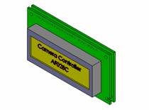
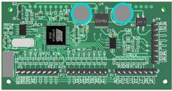

该摄像机控制器，具备Pelco D和Pelco P协议通讯功能，能实现远距离控制摄像机的功能。

#### 该控制器主要功能

* 所有的适用协议，都为RS485数据格式；
* 解码器使用Pelco D或Pelco P控制协议；
* 解码器可设置2400，4800，9600三种通信波特率；

#### 控制器控制功能

|序号|按钮标识|按钮功能|备注|
|----|-------|-------|----|
|A|BPS Switch|波特率设定|控制器通讯控制|
|B|Protocol Switch|协议选择|控制器通讯控制|
|C|CameraAddressUp|摄像机地址增(0-255)|控制器通讯控制|
|D|CameraAddressDown|摄像机地址减(0-255)|控制器通讯控制|
|1|UP|上|云台控制|
|2|DOWN|下|云台控制|
|3|LEFT|左|云台控制|
|4|RIGHT|右|云台控制|
|5|LEFT_UP|左上|云台控制|
|6|LEFT_DOWN|左下|云台控制|
|7|RIGHT_UP|右上|云台控制|
|8|RIGHT_DOWN|右下|云台控制|
|9|Auto Scan|自动扫描|云台控制|
|10|ZOOM_IN|变倍大|摄像机控制|
|11|ZOOM_OUT|变倍小|摄像机控制|
|12|FOCUS_NEAR|聚焦近|摄像机控制|
|13|FOCUS_FAR|聚焦远|摄像机控制|
|14|IRIS_CLOSE|光圈关|摄像机控制|
|15|IRIS_OPEN|光圈开|摄像机控制|

#### PELCO协议

##### 名称：PELCO-D

* 波特率：2400,4800,9600,
* 数据类型：HEX

数据包格式描述：

|包头|地址|命令1|命令2|数据1|数据2|和校验|
|----|---|-----|----|-----|-----|-----|
|0XFF|01-3F|cmd1|cmd2|dat1|dat2|chksum|
和校验：第1－6的和校验值。

命令1 和命令2的定义:

||Bit7|Bit6|Bit5|Bit4|Bit3|Bit2|Bit1|Bit0|
|---|---|---|---|----|----|----|----|----|
|命令1|自动开标志|0|0|自动开/手动|摄像头开/关|光圈关|光圈开|焦距近|
|命令2|焦距远|变倍大|变倍小|下|上|左|右|0|

适用命令解析表：

||命令1|命令2|数据1|数据2|
|-----|-----|-----|----|
|上|00|08|0|0|
|下|00|10|0|0|
|左|00|04|0|0|
|右|00|02|0|0|
|光圈关|04|00|0|0|
|光圈开|02|00|0|0|
|焦距近|01|00|0|0|
|焦距远|00|80|0|0|
|变倍大|00|40|0|0|
|变倍小|00|20|0|0|
|左上|00|0C|0|0|
|左下|00|14|0|0|
|右上|00|0A|0|0|
|右下|00|12|0|0|

#####  名称：PELCO-P

* 波特率：2400,4800,9600,
* 数据类型：HEX

数据包格式描述：

|包头|地址|数据1|数据2|数据3|数据4|包尾|和校验|
|----|---|-----|-----|----|-----|----|-----|
|0XA0|00-1F|dat1|dat2|dat3|dat4|0XAF|chksum|

和校验为1－7字节的异或运算。  
0地址代表1地址，以此类推；

数据1 和数据2的定义

||Bit7|Bit6|Bit5|Bit4|Bit3|Bit2|Bit1|Bit0|
|---|---|---|---|----|----|----|----|----|
|Command1|0|摄像头开|自动开|摄像机开/关|光圈关|光圈开|焦距近|焦距远|
|Command2|0|变倍大|变倍小|下|上|左|右|0|

适用命令解析表：

||数据1|数据2|数据3|数据4|
|---|---|---|---|---|
|上|00|08|XX|XX|
|下|00|10|XX|XX|
|左|00|04|XX|XX|
|右|00|02|XX|XX|
|光圈关|08|00|XX|XX|
|光圈开|04|00|XX|XX|
|焦距近|01|00|XX|XX|
|焦距远|02|00|XX|XX|
|变倍大|00|40|XX|XX|
|变倍小|00|20|XX|XX|
|左上|00|0C|XX|XX|
|左下|00|14|XX|XX|
|右上|00|0A|XX|XX|
|右下|00|12|XX|XX|

### 附录一  AF028C外型图

### 附录二 AF028C机械尺寸图

### 附录三 端子定义

|端子|按钮标识|按钮功能|备注|
|---|--------|-------|----|
|P1-1|RIGHT_DOWN|右下|云台控制|
|P1-2|RIGHT_UP|右上|云台控制|
|P1-3|LEFT_DOWN|左下|云台控制|
|P1-4|LEFT_UP|左上|云台控制|
|P1-5|RIGHT|右|云台控制|
|P1-6|LEFT|左|云台控制|
|P1-7|DOWN|下|云台控制|
|P1-8|UP|上|云台控制|
|||||			
|P2-1|Reserved|保留||
|P2-2|Reserved|保留||
|P2-3|IRIS_OPEN|光圈开|摄像机控制|
|P2-4|IRIS_CLOSE|光圈关|摄像机控制|
|P2-5|FOCUS_FAR|聚焦远|摄像机控制|
|P2-6|FOCUS_NEAR|聚焦近|摄像机控制|
|P2-7|ZOOM_OUT|变倍小|摄像机控制|
|P2-8|ZOOM_IN|变倍大|摄像机控制|
|||||		
|P3-1|BPS Switch|波特率设定|控制器通讯控制|
|P3-2|Protocol Switch|协议选择|控制器通讯控制|
|P3-3|CameraAddressUp|摄像机地址增|控制器通讯控制|
|P3-4|CameraAddressDown|摄像机地址减|控制器通讯控制|
|P3-5|Auto Scan|自动扫描|云台控制|
|P3-6|Reserved|保留||
|P3-7|Reserved|保留||
|P3-8|Reserved|保留||
|||||			
|P4-1|GND|地||
|P4-2|GND|地||
|P4-3|RS485A|485通讯A||
|P4-4|RS485B|485通讯B||
|P4-5|Reserved|保留||
|P4-6|Reserved|保留||
|P4-7|AC6V|电源输入||
|P4-8|AC6V|电源输入|.|

### 版本记录：

|版本|日期|作者|更改记录|
|---|----|----|-------|
|1.0|2008-10-4| hnhkj@163.com|草稿|
|1.1|2008-10-26|hnhkj@163.com|对Camera控制引脚进行了增加，增加减少按钮功能|
