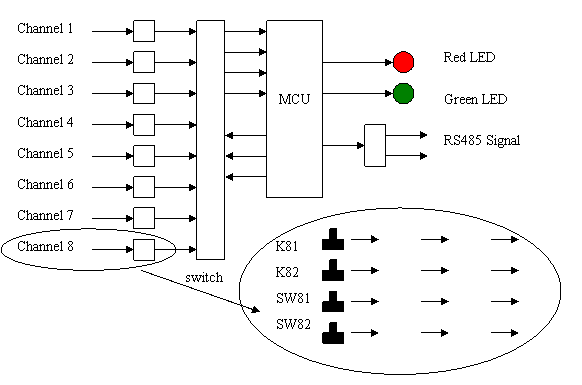
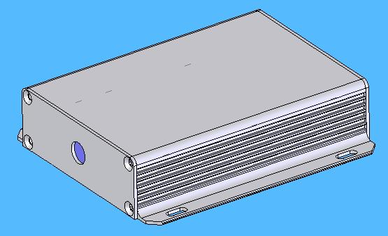
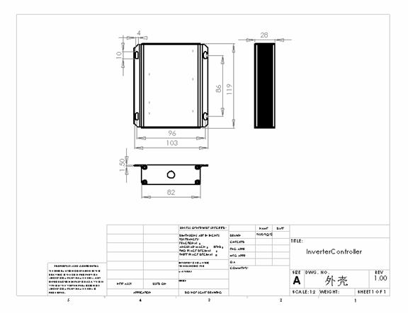
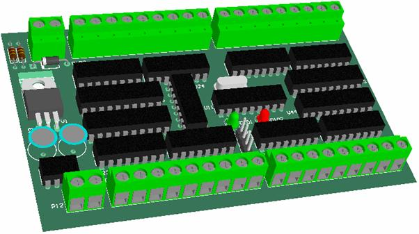
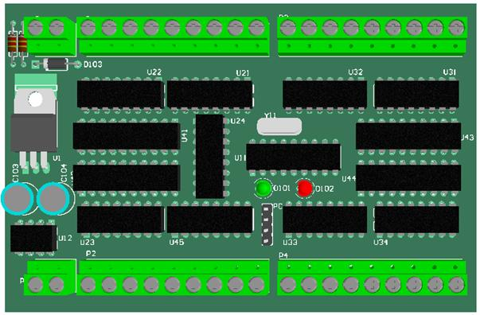

变频器控制器的设计，以三垦变频器SAMCO-VM05系列为蓝本进行设计，该控制器具备了和变频器通讯和控制的功能。

## 该控制器的主要功能：

*  控制器输入一共有8路，每一路有4个按钮；
*  控制器可以同时控制8个变频器，每一路可以控制一个变频器；
*  对于变频器的控制逻辑根据kaifa-8.mwp进行
*  运行指示、故障指示功能；

图1 变频器控制器框图

## 机械外壳

机械外壳采用金属铝外壳，该外壳一次成型，可以满足工业产品的设计要求。外型样式及尺寸见图2、图3。

图2 机械外壳外形

图3 外壳机械尺寸

## 硬件电路设计

#### 原理图

原理图根据系统控制功能进行绘制，详细图纸参见文件AF011M11_SCH.PDF。

**端子说明：**

* P11 为电源输入端子
* P12 为RS485通讯用端子
* PC 为程序测试使用
* P1、P2、P3、P4为按钮/开关输入端子（每一个端子的第一个引脚为+24V输出，供按钮/开关使用）。

**PCB外型及端子排列方式见图4**

图4 PCB外型及端子外形图

#### PCB设计

图5 PCB三维图

图6 PCB正视图

## 软件设计 （参看软件设计文档）

## 备注：
