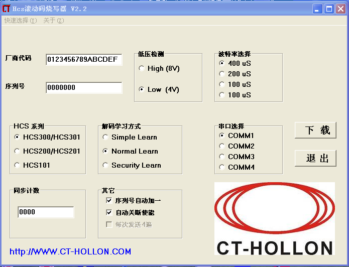
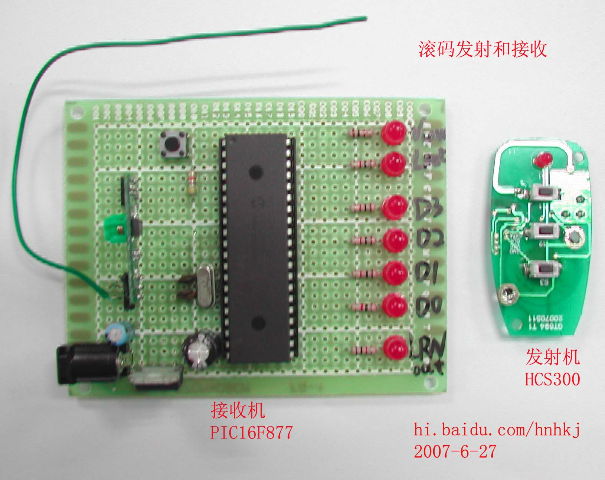
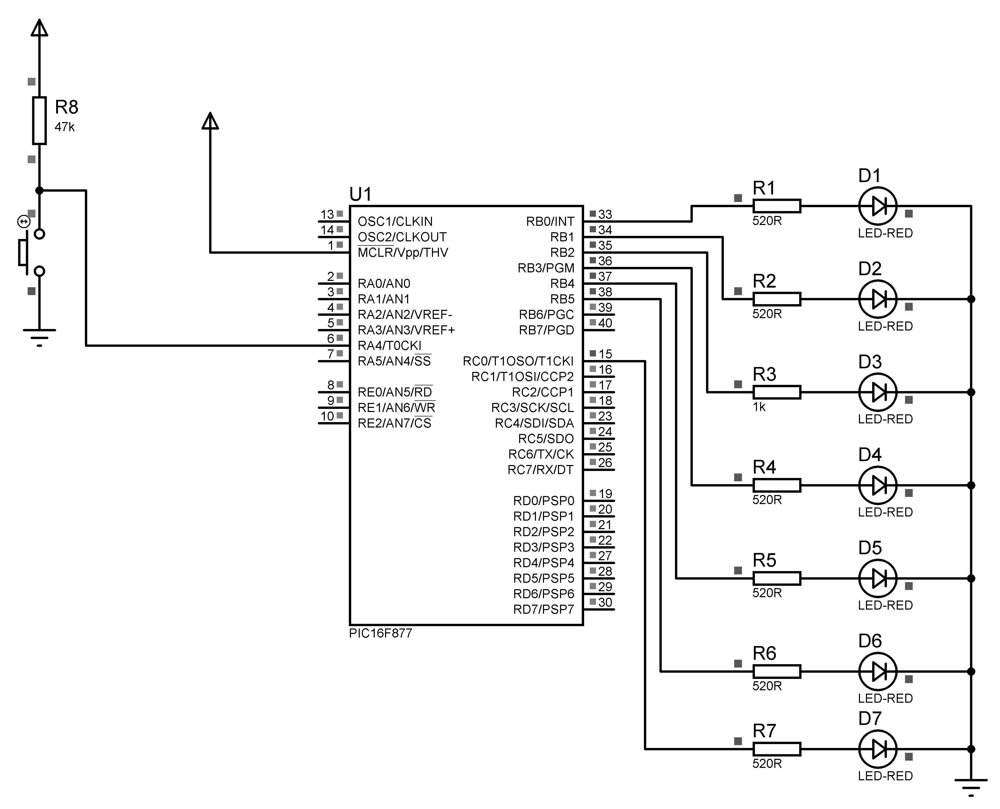

AN745-Modular Mid-Range PICmicroKEELOQ Decoder in C，该文档为MICROCHIP公司编写，该文档包含了采用PIC16F872软件解码KEELOQ的全部C语言代码。

## 发射机设置（见下图）

HCS301 - 低压检测 选择8V  
HCS300 - 低压检测 选择4V

## 接收机操作方法
1. 将遥控器按照图1的方式进行烧录；
2. 长按接收机的学习按钮18秒钟，对EEPROM进行清除，Lout指示灯会灭掉，松开学习按钮，Lout指示灯闪一下，表示清除EEPROM完成；
3. 按一下学习按钮，然后松开，接收机进入学习模式；
4. 按遥控器按钮，接收机进行学习，学习开始后Lout会闪烁几秒钟后灭掉，说明学习成功；
5. 按遥控器按钮，接收机对应按钮点亮（当按下学习时按的按钮时，Lout指示灯也会同时点亮）。

## 发射机和接收机实物

发射机采用了HCS300芯片制作，采用2片CR2016（3V）钮扣锂电池供电，433MHz-AM载波。

接收机采用PIC16F877替代PIC16F872来实现，接受模块为433MHz-AM接收。

外形图和接收机原理图见下页图

接收机原理图&程序代码参考AN744+1
