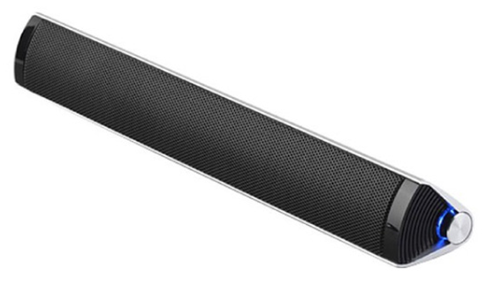
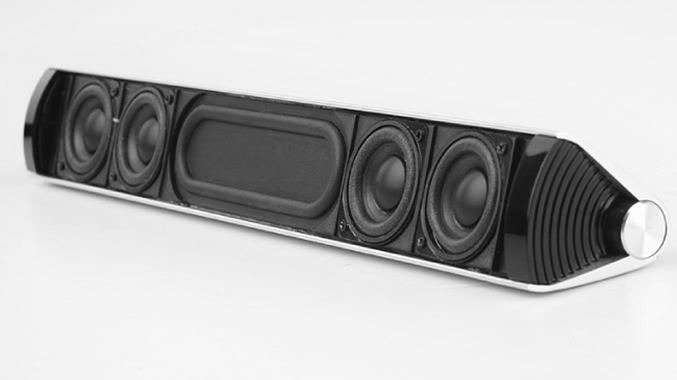
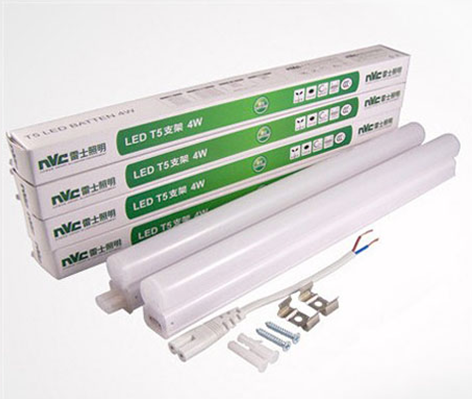
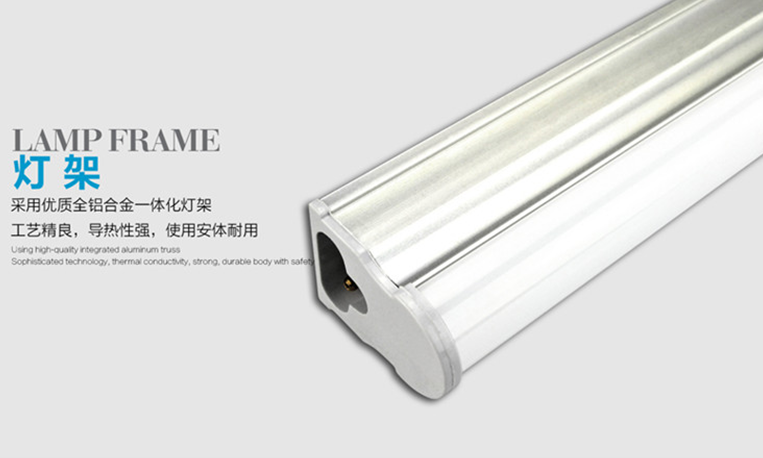
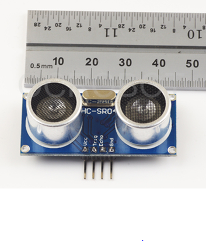
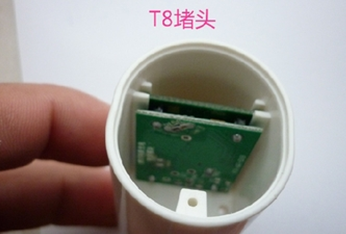
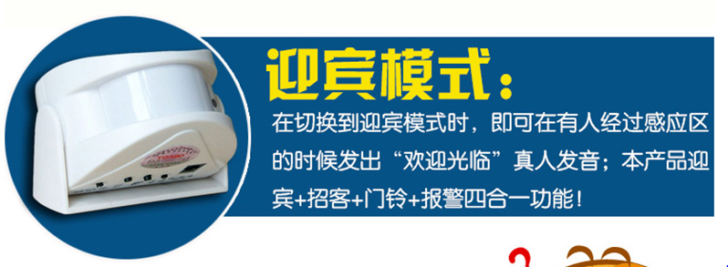
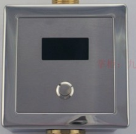

多媒体讲解器功能按照播放器功能和灯光控制功能分类。

#### 播放功能分类

* 简易型
  + 具备按键操作功能
  + TF卡升级/在线播放
  +	U盘升级/在线播放
  + 具备人体接近检测功能/红外/雷达
  +	自动播放讲解功能
  + 自动停止讲解功能
  + 自动播放音乐/自动切换到讲解功能/切换会音乐功能
  + 可以考虑电池供电

*	基本型 - 具备基本功能
  + 具备简易型所有功能
  + 具备红外线遥控/无线遥控功能

* 增强型 - 基本型+Zigbee控制
  + 具备简易型的所有功能
  + 具备Zigbee控制功能

* 豪华型 - 基本型+WIFI（RJ45）
  + 具备基本型所有功能
  + 具备联网功能
  + 具备网络更新功能/可以实时更新播放功能

#### 灯光控制功能分类

* 简易型
  + 自动亮度切换
  + 手动亮度切换

* 基本型
  +	具备简易型功能
  + 具备红外线/无线遥控功能

*	增强型
  + 具备线性调光功能
  + 具备红外线/无限遥控功能
  + 具备Zigbee控制功能

* 豪华型I
  + 具备线性三色调整
  + 具备Zigbee调光功能
  + 豪华型II
  + 具备三色调光功能
  + 具备WIFI/有线网络控制功能

####  外观设计建议

多媒体讲解器外观设计建议按照长条形状进行设计，下方可以和灯具相互结合。这样就可以实现语音讲解和灯光控制双重功能。**另外，可以考虑电池供电功能。**

#### 实现方案建议
* 音乐播放功能

  + 播放器具备MP3的基本功能，能够播放MP3，WAV等常规格式音乐文件。
  + 具备音乐文件存储功能，可以存储一定时间的讲解文件。具体时常需要考量。
  + 具备SD卡/U盘更新功能，可以将制定的讲解文档下载到播放器内。或者直接播放SD卡/U盘内容。
  + 具备音频放大器，可以直接驱动喇叭。
  + 具备外界控制功能，可以由外部MCU控制播放，停止等功能。

* 控制功能
  + 具备行人检测功能
    - 超声波距离检测：DC5V， 2cm-450cm

    

    - 雷达距离检测（DC12V 8-15m）

    
    

    - 迎宾器设计（热释电红外检测）

    

    - 小便器自动冲水检测模块（红外检测，可能也为热释电红外模式）

    

  + 具备音乐播发器控制功能

    具备UART端口，可以和音乐播放模块进行通讯.

  + 具备灯光控制功能

    具备开关量输出，或PWM输出功能

  + 具备红外遥控功能/无线遥控功能
  + 具备联网功能

    可以通过Zigbee联网或通过Ethernet进行联网

## 总结

草稿：<hnhkj@163.com> 2014/8/17
