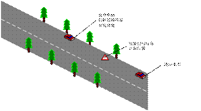
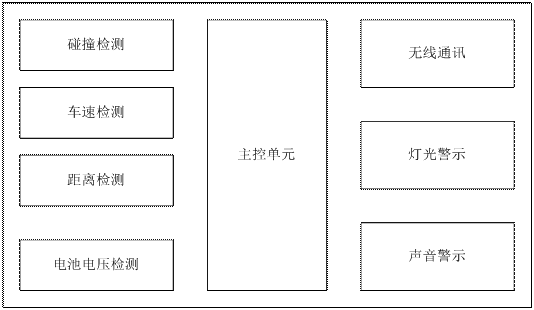
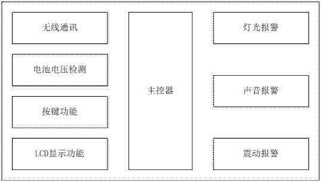

## 前言

随着我们国家汽车数量的迅速增加和快速通道的建立。 二次事故的发生也在快速增长。如何有效预防二次交通事故发生造成的人员伤亡，成为了我们必须需要面对的话题。为了能够解决这个问题，我们开发了二次事故预警设备。该套设备具备了二次事过发生前的预警和报警功能。该套设备能够在二次事故发生前产生预警信号，通知现场人员紧急避让，从而尽可能减少二次事故造成的人员伤亡。

## 系统组成

该系统主要由报警前端装置，报警终端装置两部分组成。报警前端设备才用电池供电，主要功能是对车辆进入警戒区域前/后进行检测、警示、发送报警信号给报警终端设备。报警终端装置类型分为两种，一种是车载报警终端和手持报警终端。车载报警终端用12V车载电源供电，具有警号闪灯和大功率声音报警功能。手持报警终端采用电池供电，具有声音和震动报警功能。

#### 报警前端设备

* 车距检测， 用来检测同向车辆和报警前端设备之间距离。
* 当车辆进入报警前端设备检测范围内后，报警前端设备发送警示灯，通知车辆绕行或停止。并且发送警戒信号给报警终端设备。
* 报警前端设备碰撞检测，车辆碰撞/碾压到报警前端设备后，在碰撞前端损坏前发送报警信号给报警终端设备。

#### 车载报警终端设备

* 无线通讯功能，接收报警前端设备发送的报警信号。
* 灯光警示功能，当车载报警终端打开后，警示灯闪烁警示。
* 声音报警功能，当接收到报警前端的报警信号后，车载报警终端发出报警声音，提示现场人员注意避让。

#### 手持报警终端设备

* 无线通讯功能，接收报警前端设备发送的报警信号和查看报警前端设备的状态信息。
* 显示屏，可以显示手持报警终端设备的功能状态、网络状态和报警前端设备的状态信息。
* 按键功能，可以对手持报警终端设备进行选择控制。
* 声音报警功能，在接收到报警前端设备的报警信号后，设备发出报警声音，提示避让。
* 震动报警功能，在接收到报警前端设备的报警信号后，设备产生震动，提示避让。

报警前端装置功能图

车载/手持 报警终端设备功能图

## 系统工作原理

报警前端装置和报警终端装置采用无线技术进行组网连接。多个报警前端可以和多个报警终端进行互相通讯传输。报警前端可以发送报警信号到多个报警终端设备。多个报警终端设备可以同时接收报警信号，并报警。任意报警终端设备也可以对任意报警前端设备进行设定控制。

当道路上发生交通事故后，将报警前端设备邦定到警戒标志前端，然后将警戒标志放置到同向车道指定位置。通过报警终端设备可以查看报警前端的工作状态，如电池电压、通向来车车速、碰撞传感器状态等信息。当报警前端设备进入警戒状态后，报警前端设备将开始检测同向来车车速。当检测到同向来车超速后，报警前端可以发送强光对来车进行警示，并且发送警示信号给报警终端设备。这是报警终端设备警示通向有超速车辆驶来。如果超速车辆没有减速、绕行，而是直接碰撞警示标志进入警戒区域的话，报警前端发送紧急报警信号。报警终端设备将开始发出避让报警信号。现场人员进行及时躲避，从而达到减少人员伤亡的目的。

## 总结

该项目的实施，能够解决一些实际的问题，避免不必要的财产损失。