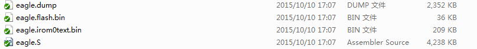
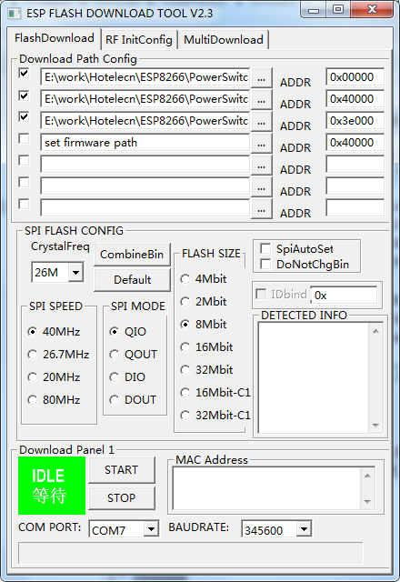
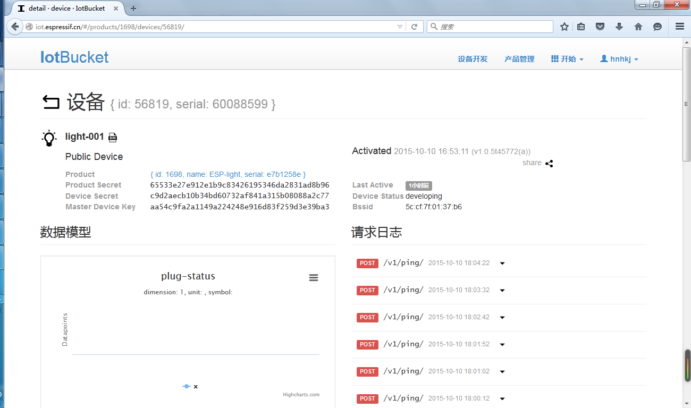

## 开发工具

#### 硬件

* AI-Thinker的小黄板，内置1MB的Flash。
* USB转UART板
* 5V电源

#### 软件资源

采用了安信可得IDE，该IDE可以运行在windows中，不需要linux环境，使用起来非常方便。

*  SDK

SDK采用了espressif的官方sdk， esp8266_iot_sdk_v1.4.0_15_09_18。
该源代码中的AT代码存在问题，已经由安信可的工程师进行了修复。非常棒


*  Android complier

Android编译器采用Google的官方编译器Android Stdio。

* Android code

<https://github.com/EspressifApp/IOT-Espressif-Android>


## 固件编译

* 固件SDK (esp8266_iot_sdk_v1.4.0_15_09_18)
* 复制examples/文件到app目录中
* 修改app/include/user_config.h中的

 > #if ESP_PLATFORM  
 > #define PLUG_DEVICE             0  
 > #define LIGHT_DEVICE            1  
 > #define SENSOR_DEVICE			0  

 > #if SENSOR_DEVICE  
 > #define HUMITURE_SUB_DEVICE         1  
 > #define FLAMMABLE_GAS_SUB_DEVICE    0  
 > #endif  

* 编译项目，在Bin中生成下面文件

 

* 通过FLASH_DOWNLOAD_TOOLS_v2.4_150924将eagle.flash.bin和eagle.irom0text.bin烧录到指定的位置。

*特别注意：如果需要开启iot.espressif.cn的云服务功能，需要在网站注册到一个特定的设备ID，并且将这个ID烧录到Flash（0x3e000）中。这样子可以通过curl开启云服务功能。如果没有这个id的话，我们只能在局域网内对模块进行控制。*

*目前我注册了一个ID，它是aa54c9fa2a1149a224248e916d83f259d3e39ba3，通过这个ID可以实现远程的云控制。*





## 模块调试

* 将模块加入到我的wifi网络中。并且将该模块注册到iot.espressif.cn中。该模块的ID为aa54c9fa2a1149a224248e916d83f259d3e39ba3

```
curl -X POST -H "Content-Type:application/json" -d "{\"Request\":{\"Station\":{\"Connect_Station\":{\"ssid\":\"home\",\"password\":\"123467890\",\"token\":\"aa54c9fa2a1149a224248e916d83f259d3e39ba3\"}}}}" http://192.168.4.1/config?command=wifi
```

* 模块注册成功后会在iot.espressif.cn中查看到，如下图


* 可以通过IOT Espressif对模块进行控制，调光开关等操作。

## 问题

* 当我将模块作为Plug来控制的时候，一直没有成功。测试了多次。还没有成功。

* smart_config代码添加到到了APP中，可是系统运行混乱，不知道什么原因。还没有时间进行详细测试。


## 感悟

整个流程调试通了，有了不少的收获。

## SmartConfig  - 测试OK


## 参考：

Android源代码  
<https://github.com/EspressifApp/IOT-Espressif-Android>

espressif sdk  
<http://espressif.com/new-sdk-release/>
